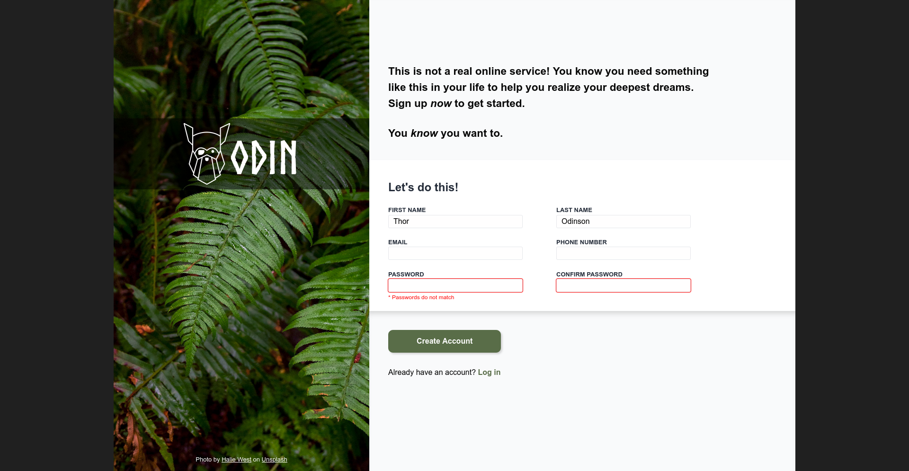

# The Odin Project - Sign-up Form Project

This is a solution to the [Sign-up Form Project of the Intermediate HTML and CSS Course on The Odin Project](https://www.theodinproject.com/lessons/node-path-intermediate-html-and-css-sign-up-form).

## Table of contents

- [Overview](#overview)
  - [The challenge](#the-challenge)
  - [Screenshot](#screenshot)
  - [Links](#links)
- [My process](#my-process)
  - [Built with](#built-with)
  - [What I learned](#what-i-learned)
  - [Continued development](#continued-development)
- [Author](#author)

## Overview

### The challenge

This project is going to implement what I learned with forms and CSS selectors.

### Screenshot

### Links

- Solution URL: [https://github.com/wmartyr/top-sign-up-form](https://github.com/wmartyr/top-sign-up-form)
- Live Site URL: [https://wmartyr.github.io/top-sign-up-form](https://wmartyr.github.io/top-sign-up-form)

## My process

### Built with

- Semantic HTML5 markup
- CSS custom properties
- Flexbox
- CSS Grid
- Forms

### What I learned

I learned to create forms and style them differently than the default.

### Continued development

I need to do more projects to reinforce what I learned.

## Author

- Woodrow Martyr